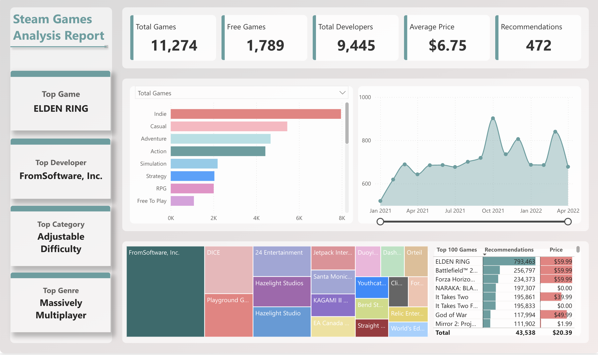

# Steam Games Analysis Project

## Table of Contents

- [Overview](#overview)
- [Project Architecture](#project-architecture)
- [Data Flow](#data-flow)
- [Technical Stack](#technical-stack)
- [Key Features](#key-features)
- [Project Structure](#project-structure)
- [Report Sample](#report-sample)

## Overview

This project implements an end-to-end data engineering solution for analyzing Steam games data using Azure cloud services. It follows the Medallion architecture pattern to transform raw game data into a structured, analytics-ready format with data quality validation and automated reporting.

## Report Sample



The Power BI report provides interactive visualizations of:
- Game release trends over time
- Genre and category distributions
- Developer and publisher analytics
- Price and recommendation analysis
- Time-based insights with date table relationships

---

## Project Architecture


The architecture consists of three main layers:

- **Data Ingestion**: Raw CSV files stored in Azure Data Lake Storage (ADLS)
- **Data Processing**: Azure Synapse Analytics with Spark notebooks for ETL operations
- **Data Visualization**: Microsoft Fabric with Power BI for reporting and analytics

## Data Flow

### 1. Bronze Layer (Raw Data Ingestion)
- **Source**: CSV files from `raw/` directory in ADLS
- **Process**: 
  - Stream ingestion using Spark Structured Streaming
  - Schema validation and metadata capture (load_time, source_file)
  - Data quality validation with Great Expectations
  - Failed records quarantined to `data_quality_quarantine` table
- **Output**: Delta tables in `medallion/bronze/steam_game_bz/`

### 2. Silver Layer (Cleansed & Enriched Data)
- **Source**: Bronze layer Delta tables
- **Process**:
  - Date parsing and standardization (handles multiple date formats)
  - Duplicate removal
  - Null value handling (fill with defaults)
  - Data type conversions (string to date)
  - MERGE operations for upserts
- **Output**: Delta tables in `medallion/silver/steam_game_sl/`

### 3. Gold Layer (Analytics-Ready Data)
- **Source**: Silver layer Delta tables
- **Process**:
  - Dimensional modeling (fact and dimension tables)
  - Array explosion for genres, categories, developers, publishers
  - Star schema creation:
    - `fact_steam_games_gl`: Core game metrics
    - `dim_genres_gl`: Game genres
    - `dim_categories_gl`: Game categories
    - `dim_developers_gl`: Developer information
    - `dim_publishers_gl`: Publisher information
- **Output**: Delta tables in `medallion/gold/` for Power BI consumption

## Technical Stack

### Azure Services
- **Azure Synapse Analytics**: Data processing with Spark 3.5
- **Azure Data Lake Storage Gen2**: Data storage with Delta Lake format
- **Microsoft Fabric**: Power BI semantic models and reports
- **Great Expectations**: Data quality validation framework

### Technologies
- **Apache Spark**: Distributed data processing (PySpark)
- **Delta Lake**: ACID transactions and time travel
- **Spark Structured Streaming**: Real-time data processing
- **Power BI**: Business intelligence and visualization

### Key Technical Features
- **Streaming Processing**: Spark Structured Streaming with checkpointing
- **Data Quality**: Great Expectations integration with row-level and table-level validation
- **Upsert Operations**: MERGE statements for incremental updates
- **Watermarking**: Late-arriving data handling (30-second watermark)
- **Delta Streaming**: Change Data Feed (CDF) from Delta tables

## Key Features

### Data Quality Assurance
- Automated validation using Great Expectations suites
- Row-level error tracking and quarantine
- Table-level schema validation
- Failed records stored in quarantine table for review

### Scalability
- Spark cluster configuration: 10 nodes, 4 cores, 28GB memory per node
- Dynamic allocation disabled for consistent performance
- Parallel processing with multiple Spark pools

### Data Transformation
- Flexible date parsing (handles formats: "Jul 5, 2024", "Q4 2025", "2025", etc.)
- Array/semicolon-separated value explosion for multi-value fields
- Type-safe transformations with schema enforcement

### Automation
- Pipeline orchestration via Azure Synapse Pipelines
- Parameterized notebooks for flexible execution
- Automated job scheduling support

## Project Structure

```
Azure_git/
├── adls/                          # Azure Data Lake Storage structure
│   └── steam-game-project/
│       ├── raw/                   # Raw CSV files
│       ├── medallion/
│       │   ├── bronze/            # Raw ingested data
│       │   ├── silver/            # Cleansed data
│       │   └── gold/              # Analytics-ready data
│       └── gx_config/             # Great Expectations configuration
│
├── synapse_steam_game/            # Azure Synapse workspace
│   ├── notebook/
│   │   ├── 00_common_functions    # Shared utility functions
│   │   ├── 01_setup               # Table creation and setup
│   │   ├── 02_bronze              # Bronze layer ingestion
│   │   ├── 03_silver              # Silver layer transformation
│   │   ├── 04_gold                # Gold layer dimensional modeling
│   │   ├── 05_run_job             # Main orchestration notebook
│   │   └── great_expectations_*   # Data quality processing
│   └── pipeline/
│       └── run_job                # Pipeline definition
│
├── fabric/                        # Microsoft Fabric artifacts
│   └── steam_games_analysis_report/
│       ├── Report/                # Power BI report
│       └── SemanticModel/         # Data model (TMDL)
│
└── report/                        # Power BI report files
    └── sample/
        └── dashboard.png          # Report sample
```


